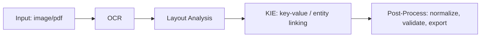

# MODEL_CARD — KIE

## 指紋
- 權重：model.safetensors  size=1B T  sha256=34d00d9df1096b801ca5f7494baf4ee1a9389a72820ef5e3c1b0f9b902e3c2ed  mode=lite
- config：config.json
- tokenizer：tokenizer.json, tokenizer_config.json, sentencepiece.bpe.model

## PIPELINE（示意）

## 使用方式
解壓後執行：
  bash RUNME_kie.sh <text_or_jsonl> [gold.jsonl]
若為 LITE：請先依 kie/PLACE_WEIGHTS_HERE.txt 放入原始權重。
